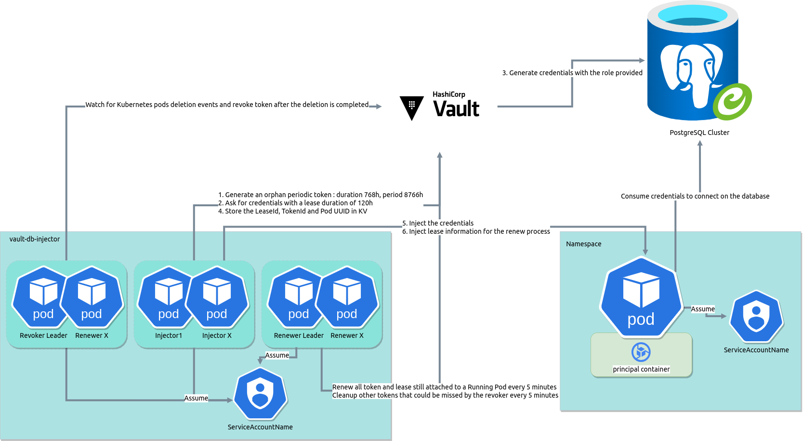

# How it Work

##  1. <a name='Vault-Injector'></a>Vault-Injector

The Vault DB Injector is a Go program that is design to retrieve databases credentials from Hashicorp Vault, it use Kubernetes Mutating Webhook to intercept pod creation activated with a label and configured with annotations.
After the credentials are provided, it will store them in a specific Vault KV and will handle the lifecycle of them such as : 
- Renew them periodically
- Revoke them after the pod is deleted 

###  1.1. <a name='Mechanism'></a>Mechanism

####  1.1.1. <a name='VaultInjector:'></a>Vault Injector:

1. Connects to Vault to generate credentials.
2. Vault will create a temporary role in PostgreSQL for the database.
3. Retrieves the credentials via Vault.
4. Modifies the pod by adding the credentials in the form of environment variables.
5. The pod can now connect to the database.
6. Handle token / lease renewing and revokation.

###  1.2. <a name='Diagram'></a>Diagram



###  1.3. <a name='VaultUsage'></a>Vault Usage

Their is also a fonctionnality that permit to rotate token directly from the injector. Objectif is to keep token as secure as possible.
For this purpose, we have made the choice to store the token directly on Vault in a specific KV.
We provide a generated random UUID to every pod which will be use as a unique identifier. As long as the pod is alive, the injector will rotate
his token 5 minutes by default. If the pods is deleted, the revoker will revoke the token and the lease and the renewer which is design to keep the state will also delete the secret in the KV.

If the injector reboot or fail for any reason, the token can stil be renewed manually or by restarting the injector correctly. He can retrieve 
all token that was created previously.
The renewer will renew all tokens and leases every 5 minutes by default.

We are using periodic token for this purpose which need absolutely "sudo" policy.
Periodic token permit to add a max_ttl and to have infinite token that can be renewed until the pod is deleted.
Token TTL permit to fix the max_ttl of the token which mean : "How many time my token can belong without been renewed."
By default, if the token is not renewed, hes timelife is 32 days, that mean, if the injector fail, you have 31 days and 23 hours before all your token will expire, which i think is enough to understand why and repair it to a working state.

With this setup, the advantage is that now, vault is the only real SPOF.
The Injector in renewer mode will only renew TOKEN and LEASE and cleanup KV/STORE that has been created by the Injector.
The Injector in revoker mode will only revoke TOKEN when a pod has been deleted
If the revoker fail to revoke a Token, the renewer can do it periodically every 5 minutes (This will be probably removed in future version.)

###  1.4. <a name='Authentication'></a>Authentication

It uses a service account and the Kubernetes mount point to retrieve and generate its information. It then sends the following information to the application:

- Username: A database user generated by Vault.
- Password: A database password generated by Vault.

It will store on a specific vault KV/Store the following : 

- LeaseID
- TokenID
- Namespace
- UUID

###  1.5. <a name='Howtokenarehandled'></a>How token are handled ?

They are two kind of token that are created in the lifecycle of the Vault injector : 

1. Token created for the Injector using `kubeRole: ` in the yaml config
   - Permit to generate OrphanToken for our pods that will access to DB
   - Permit to renew and revoke all the OrphanToken
   - Permit to store data token inside the KV from `vaultSecretName: vault-injector` and prefix : `vaultSecretPrefix: kubernetes1-dv-par5`
   - TTL is 1h but will always be revoked after the tasks is completed.
   - This token will be revoked after the webhook is generated.
2. OrphanToken created on a webhook request which are stored on Vault with the pods UUID and configured by annotation `db-creds-injector.numberly.io/role:` and `db-creds-injector.numberly.io/dbname.role:`
   - Permit to generate the LeaseId that will be provided to the pod
   - Permit to generate the DB credentials
   - Will be revoked when the pod is deleted
   - Is a periodic token with TTL : `tokenTTL: 768h`

###  1.6. <a name='Howdoesinjectorworkthen'></a>How does injector work then ?

1. A new pod is created with label `vault-db-injector: "true"`, annotations `db-creds-injector.numberly.io/cluster:` & `db-creds-injector.numberly.io/role:` and a serviceaccount
2. The api-server use mutating-webhook to send the pods template to the injector
3. The injector will generate a new orphan token and do thoses steps : 
   - Does the serviceaccount attached to my pod is allowed to assume my role on Vault. If the SA or the namespace is no't allowed, it will return an error, else, it will continue the process.
   - Generate a new orphan token with a specific period and the policy provided in the annotation by the pod.
   - Generate an UUID and add a specific annotation on the pod with IT
   - Ask vault to generate DB Credentials for the pods with the new Orphan Token
   - Store on vault on the specific KV the `LeaseId`, `TokenId`, `namespace` in a folder named with the pod UUID
   - Revoke all intermediate Token
4. The injector will return back to the api-server with a modified pod template
5. The api-server will create the new pods with modified informations

The available annotations can be declare like this : 

- `db-creds-injector.numberly.io/cluster`, [OPTIONAL] default to `databases` which is the database engine to use
- `db-creds-injector.numberly.io/role`, [MANDATORY] Role to be use to get db credentials
- `db-creds-injector.numberly.io/dbname.role`, [OPTIONAL] Role to be use to get db credentials for this specific database
- `db-creds-injector.numberly.io/dbname.env-key-dbuser`, [OPTIONAL] overwrite DB user env variable, default to `DBUSER`
- `db-creds-injector.numberly.io/dbname.env-key-dbpassword`, [OPTIONAL] overwrite DB password env variable, default to `DBPASSWORD`
- `db-creds-injector.numberly.io/dbname.mode`, [MANDATORY] the mode for the injector, default to `classic`.

###  1.7. <a name='Usage:'></a>Usage : 

####  1.7.1. <a name='Inmodeclassic'></a>In mode classic
```yaml
# To be added in the pod spec
annotations:
  db-creds-injector.numberly.io/cluster: databases
  db-creds-injector.numberly.io/dbname.env-key-dbpassword: DB_PASSWORD
  db-creds-injector.numberly.io/dbname.env-key-dbuser: DB_USER
  db-creds-injector.numberly.io/dbname.role: db-role # the one created from vault with terraform
  db-creds-injector.numberly.io/dbname.mode: classic
labels:
  vault-db-injector: "true"
```

####  1.7.2. <a name='InmodeURI'></a>In mode URI
```yaml
annotations:
  db-creds-injector.numberly.io/cluster: databases
  db-creds-injector.numberly.io/dbname.template: postgres://@postgres-server.tld:5432/dbname?sslmode=require
  db-creds-injector.numberly.io/dbname.role: db-role
  db-creds-injector.numberly.io/dbname.env-key-uri: POSTGRES_URL
  db-creds-injector.numberly.io/dbname.mode: uri
labels:
  vault-db-injector: "true"
```

####  1.7.3. <a name='Withmultipledatabases'></a>With multiple databases
```yaml
annotations:
  db-creds-injector.numberly.io/cluster: databases
  db-creds-injector.numberly.io/dbname.env-key-dbpassword: DB_PASSWORD
  db-creds-injector.numberly.io/dbname.env-key-dbuser: DB_USER
  db-creds-injector.numberly.io/dbname.role: db-role # the one created from vault with terraform
  db-creds-injector.numberly.io/dbname.mode: classic
  db-creds-injector.numberly.io/other_dbname.template: postgres://@postgres-server.tld:5432/dbname?sslmode=require
  db-creds-injector.numberly.io/other_dbname.role: another-vault-role
  db-creds-injector.numberly.io/other_dbname.env-key-uri: POSTGRES_URL,ANOTHER_ENV
  db-creds-injector.numberly.io/other_dbname.mode: uri
labels:
  vault-db-injector: "true"
```
Here, as you can see, we can connect to 2 databases `dbname` and `other_dbname`.
