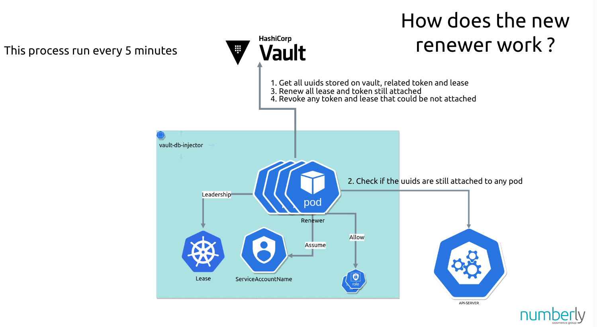

# Renewer

**Key File:** `pkg/renewer/renewer.go`

##  1. How It Works:

The Renewer is a crucial component responsible for ensuring that database credentials remain valid over time. It periodically checks the status of the credentials and renews them before they expire. This process is critical in environments where credentials have a limited lifespan and need to be refreshed to maintain access.

##  2. Key Responsibilities:

1. **Periodic Checks:**
   - The Renewer periodically checks the expiration status of the current database credentials. It ensures that credentials are always valid and do not reach their expiration date unnoticed.

2. **Credential Renewal:**
   - Credentials are Renewed using Periodic Token so it ensure that during his whole lifetime, the application never need to restarted.

##  3. Benefits:

- **Automatic Management:**
  - By automating the renewal of credentials, the Renewer eliminates the need for manual intervention, reducing administrative overhead and the risk of human error.

- **Continuous Availability:**
  - Ensures that applications have uninterrupted access to the database by renewing credentials well before they expire, thus preventing potential downtime.

- **Security:**
  - Regularly rotating credentials enhances security by limiting the lifespan of any single set of credentials, reducing the risk of credential compromise.

This feature is particularly useful for maintaining secure and continuous database access in dynamic cloud environments, where credential rotation is a best practice for security.
