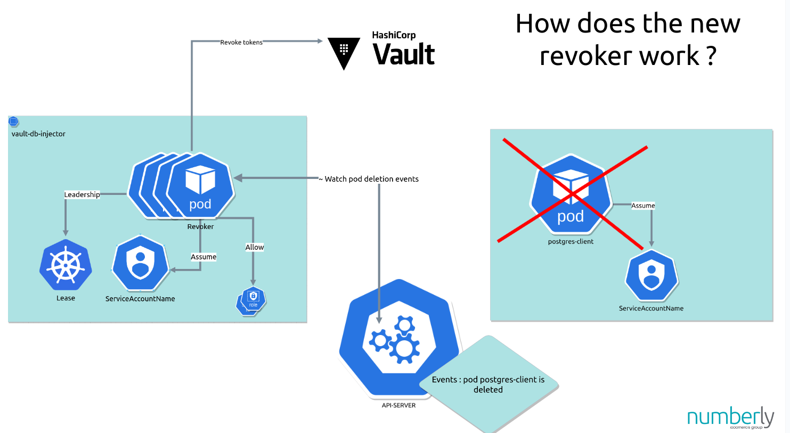

# Revoker

<!-- vscode-markdown-toc -->
* 1. [How It Works:](#HowItWorks:)
* 2. [Key Responsibilities:](#KeyResponsibilities:)
* 3. [Benefits:](#Benefits:)

<!-- vscode-markdown-toc-config
	numbering=true
	autoSave=true
	/vscode-markdown-toc-config -->
<!-- /vscode-markdown-toc -->

**Key File:** `pkg/revoker/revoker.go`

##  1. How It Works:

The Revoker is responsible for ensuring that unused or stale database credentials are properly revoked. This process is essential for maintaining the security of your system by ensuring that credentials that are no longer needed are not left active.

##  2. Key Responsibilities:

1. **Identifying Stale Credentials:**
   - The Revoker identifies credentials that are no longer in use or have become stale. This could be because the application instance that was using them has been terminated, or the credentials have exceeded their intended lifespan.

2. **Revoking Credentials:**
   - Once stale or unused credentials are identified, the Revoker sends a request to HashiCorp Vault to revoke these credentials. This action ensures that these credentials can no longer be used to access the database.

3. **Updating System State:**
   - The Revoker updates the system's state to reflect that certain credentials have been revoked. This helps in maintaining an accurate and secure overview of active and inactive credentials.

4. **Automatic revocation:**
   - The Revoker is watching Kubernetes event and especially `DELETE` event on pod so it can revoke the credentials direcly after the pod is Deleted, this permit to be sure credentials are not revoked before the pods completely deleted.

##  3. Benefits:

- **Enhanced Security:**
  - By revoking unused or stale credentials, the Revoker minimizes the risk of unauthorized access. This is crucial in environments where security is a top priority.

- **Reduced Attack Surface:**
  - Removing credentials that are no longer needed reduces the number of potential entry points for attackers, thus lowering the overall risk profile of the system.

- **Compliance and Audit:**
  - Regularly revoking credentials helps in complying with security policies and audit requirements. It demonstrates proactive management of access credentials.

This feature is particularly important in dynamic environments where resources and their associated credentials are frequently created and destroyed. It ensures that credentials do not linger beyond their useful life, thereby maintaining a high standard of security.
