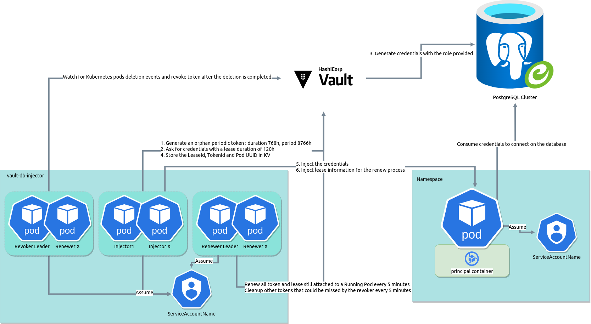

# Vault DB Injector

## Overview

The Vault DB Injector is a Kubernetes-based application designed to dynamically generate database credentials using HashiCorp Vault and provide them as environment variables to Kubernetes Pods. The application leverages a Mutating Webhook to achieve this functionality, ensuring secure and automated management of database credentials.

## Key Features

### 1. **Dynamic Database Credential Injection**
- **Description:** Automatically generates and injects database credentials into Kubernetes Pods at runtime using HashiCorp Vault.
- **Benefit:** Enhances security by avoiding static credentials and ensuring credentials are rotated and managed dynamically.

### 2. **Mutating Webhook**
- **Description:** Uses Kubernetes Mutating Admission Webhook to modify pod specifications on-the-fly and inject the necessary environment variables.
- **Benefit:** Seamlessly integrates with Kubernetes, providing a transparent and automated way to manage secrets.

### 3. **Configuration Management**
- **Description:** Supports configuration through YAML files and environment variables.
- **Benefit:** Offers flexibility and ease of configuration for different deployment environments.

### 4. **Error Monitoring with Sentry**
- **Description:** Integrates with Sentry to capture and report errors.
- **Benefit:** Provides robust error tracking and monitoring, helping maintain application reliability and performance.

### 5. **Logging**
- **Description:** Utilizes `logrus` for structured logging, supporting various log levels and JSON formatting.
- **Benefit:** Ensures clear and consistent logging, aiding in debugging and monitoring.

### 6. **Kubernetes Integration**
- **Description:** Provides utilities for interacting with the Kubernetes API, including service account token retrieval and client initialization.
- **Benefit:** Facilitates seamless integration with Kubernetes clusters, enhancing the application's capabilities and ease of use.

### 7. **Leader Election**
- **Description:** Implements leader election using Kubernetes resource locks to ensure high availability and fault tolerance.
- **Benefit:** Ensures that critical tasks are performed by a single instance in a distributed system, enhancing reliability.

### 8. **Health Checks**
- **Description:** Implements health check endpoints to monitor the application's status and readiness.
- **Benefit:** Ensures the application is running correctly and is ready to handle requests, improving overall system stability.

### 9. **Prometheus Metrics**
- **Description:** Integrates with Prometheus to expose metrics for monitoring.
- **Benefit:** Provides insights into application performance and resource usage, aiding in proactive management and optimization.

## Getting Started

To get started with Vault DB Injector, refer to the [Installation Guide](getting-started/getting-started.md) and [Configuration Guide](how-it-works/configuration.md) for detailed instructions on setting up and configuring the application.

For a deeper understanding of how the application works, visit the [How It Works](how-it-works/how-it-work.md) section.

## Contributing

We welcome contributions from the community! Please see our [Contribution Guidelines](getting-started/contributing.md) for more information on how to get involved.

## License

This project is licensed under the terms of the MIT license. See the [LICENSE](LICENSE) file for details.

## Contact

For any questions or support, please reach out to our team at [support@numberly.com](mailto:support@numberly.com).

