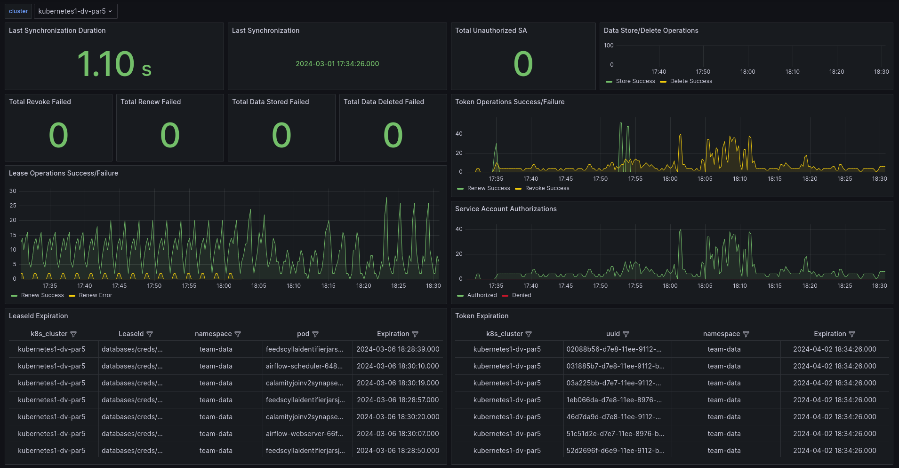

# Monitoring

**Audience:** Opérateur de plateforme

!!! note
    Utilisateurs v2.x — voir [migration](migration-v2-to-v3.md) pour le renommage des métriques.
    Toutes les métriques ont été renommées du préfixe `vault_injector_*` vers
    `vdbi_*` dans la v3.0.

## Prometheus

L'injector, le renewer et le revoker exposent chacun un endpoint Prometheus.
Les métriques sont regroupées par phase du cycle de vie (renouvellement /
révocation de token / bail, admission), bookkeeping (stockage/suppression KV),
autorisation (`service_account_*`), et ajouts v3.0 pour le mode NRI et le mode
projected-SA.

| Nom de la métrique                                   | Description                                                               | Labels                                |
|--------------------------------------------------    |---------------------------------------------------------------------------|---------------------------------------|
| `vdbi_renew_token_count_success`           | Nombre de renouvellements de token réussis                                | `uuid`, `namespace`                   |
| `vdbi_renew_token_count_error`             | Nombre de renouvellements de token en erreur                              | `uuid`, `namespace`                   |
| `vdbi_renew_lease_count_success`           | Nombre de renouvellements de bail réussis                                 | `uuid`, `namespace`                   |
| `vdbi_renew_lease_count_error`             | Nombre de renouvellements de bail en erreur                               | `uuid`, `namespace`                   |
| `vdbi_revoke_token_count_success`          | Nombre de révocations de token réussies                                   | `uuid`, `namespace`                   |
| `vdbi_revoke_token_count_error`            | Nombre de révocations de token en erreur                                  | `uuid`, `namespace`                   |
| `vdbi_token_expiration`                    | Timestamp d'expiration des tokens                                         | `uuid`, `namespace`                   |
| `vdbi_lease_expiration`                    | Timestamp d'expiration des baux                                           | `uuid`, `namespace`                   |
| `vdbi_token_last_renewed`                  | Dernier renouvellement de token réussi                                    | `uuid`, `namespace`                   |
| `vdbi_synchronization_count_success`       | Nombre de synchronisations réussies                                       |                                       |
| `vdbi_synchronization_count_error`         | Nombre de synchronisations en erreur                                      |                                       |
| `vdbi_pod_cleanup_count_success`           | Nombre de nettoyages de pod réussis                                       |                                       |
| `vdbi_pod_cleanup_count_error`             | Nombre de nettoyages de pod en erreur                                     |                                       |
| `vdbi_last_synchronization_success`        | Timestamp de la dernière synchronisation réussie                          |                                       |
| `vdbi_orphan_ticket_created_count_success` | Nombre de tickets orphelins créés avec succès                             |                                       |
| `vdbi_orphan_ticket_created_count_error`   | Nombre de tickets orphelins créés en erreur                               |                                       |
| `vdbi_store_data_count_success`            | Nombre de stockages de données réussis                                    | `uuid`, `namespace`                   |
| `vdbi_store_data_count_error`              | Nombre de stockages de données en erreur                                  | `uuid`, `namespace`                   |
| `vdbi_delete_data_count_success`           | Nombre de suppressions de données réussies                                | `uuid`, `namespace`                   |
| `vdbi_delete_data_count_error`             | Nombre de suppressions de données en erreur                               | `uuid`, `namespace`                   |
| `vdbi_connect_vault_count_success`         | Nombre de connexions à Vault réussies                                     |                                       |
| `vdbi_connect_vault_count_error`           | Nombre de connexions à Vault en erreur                                    |                                       |
| `vdbi_service_account_authorized_count`    | Nombre de ServiceAccounts autorisés à assumer un dbRole                   |                                       |
| `vdbi_service_account_denied_count`        | Nombre de ServiceAccounts refusés pour un dbRole                          | `service_account_name`, `namespace`, `db_role`, `cause` |
| `vdbi_last_synchronization_duration`       | Durée de la dernière synchronisation                                      |                                       |
| `vdbi_is_leader`                           | Vaut 1 si l'instance est leader, sinon 0                                  | `lease_name`                          |
| `vdbi_leader_election_attempts_total`      | Nombre total de tentatives d'acquisition du leadership                    | `lease_name`                          |
| `vdbi_leader_election_duration_seconds`    | Durée en secondes pendant laquelle cette instance est leader              | `lease_name`, `leader_name`, `mode`   |
| `vdbi_fetch_pods_success_count`            | Nombre de récupérations de pods sans erreur                               |                                       |
| `vdbi_fetch_pods_error_count`              | Nombre de récupérations de pods en erreur                                 |                                       |
| `vdbi_mutated_pods_success_count`          | Nombre de pods mutés avec succès                                          |                                       |
| `vdbi_mutated_pods_error_count`            | Nombre d'erreurs lors de la mutation de pods                              |                                       |

### Métriques v3.0 — mode NRI

| Nom de la métrique                         | Description                                                               | Labels                                |
|--------------------------------------------|---------------------------------------------------------------------------|---------------------------------------|
| `vdbi_nri_substitutions_total`             | Nombre d'événements CreateContainer où le plugin NRI a émis un ajustement d'environnement | |
| `vdbi_nri_unwrap_failures_total`           | Nombre d'échecs du plugin NRI lors de la résolution des identifiants à CreateContainer    | `reason`                              |
| `vdbi_nri_resolve_duplicate_total`         | Nombre d'appels `resolveMapping` ayant rejoint un appel en cours (singleflight). Doit rester proche de 0 en fonctionnement normal ; les pics indiquent des courses CreateContainer concurrentes. | |

### Métriques v3.0 — mode projected-SA

| Nom de la métrique                         | Description                                                               | Labels                                |
|--------------------------------------------|---------------------------------------------------------------------------|---------------------------------------|
| `vdbi_token_request_errors_total`          | Nombre d'appels Kubernetes TokenRequest échoués (par ServiceAccount de pod, mode projected-SA) | `reason` (`rbac_denied`, `sa_not_found`, `unauthorized`, `other`) |
| `vdbi_vault_login_errors_total`            | Nombre de connexions Vault échouées, classées pour le triage              | `reason` (`audience_mismatch`, `sa_not_bound`, `role_not_found`, `vault_sealed`, `permission_denied`, `other`), `auth_mode` (`legacy`, `projected`, `projected_bookkeeping`) |
| `vdbi_projected_role_misconfigured_total`  | Nombre de fois où un rôle Vault utilisé en mode projected-SA a été trouvé sans `token_period > 0` (le pod-token mourra à `token_max_ttl`) | `role` |

## Grafana

Un tableau de bord de référence est fourni dans le dépôt à
[`dashboard.json`](https://github.com/numberly/vault-db-injector/blob/main/docs/operators/dashboard.json).
Importez-le dans Grafana via **Dashboards → Import → Upload JSON file**,
pointez-le sur votre source de données Prometheus, et vous obtenez des panneaux
pour le cycle de vie des tokens et des baux, le débit d'admission, l'état du
leader, et les ventilations d'échecs NRI / projected-SA v3.0.



## Alertmanager

Les règles ci-dessous couvrent les modes de défaillance qui justifient une
alerte : refus d'autorisation de ServiceAccount, échecs de renouvellement de
token ou de bail, et avertissements d'expiration avant l'épuisement du TTL.
Ajustez les durées `for:` et les labels de sévérité à votre posture d'astreinte
avant de déployer.

### ServiceAccount refusé

```yaml
- alert: VaultDbInjectorServiceAccountDenied
  annotations:
    description: "Service Account (SA) `{{ $labels.service_account_name }}` in namespace `{{ $labels.exported_namespace }}` was denied access to db_role `{{ $labels.db_role }}` due to `{{ $labels.cause }}` on cluster `{{ $labels.k8s_cluster }}`. Immediate investigation is recommended to ensure proper access controls and service configurations."
    summary: "Service Account `{{ $labels.service_account_name }}` in namespace `{{ $labels.exported_namespace }}` was denied by the injector."
  expr: increase(vdbi_service_account_denied_count{}[2m]) > 0
  for: 1m
  labels:
    severity: critical
```

**Actions correctives :**

- Vérifier les permissions et rôles du ServiceAccount.
- Contrôler la configuration des db_role.
- Analyser la cause du refus.

### Échec de renouvellement de token

```yaml
- alert: VaultDbInjectorFailToRenewToken
  annotations:
    description: "VaultDbInjector encountered an error while attempting to renew a token. This might affect the continuous operation of dependent services."
    summary: "VaultDbInjector token renewal failure for namespace `{{ $labels.exported_namespace }}` on cluster `{{ $labels.k8s_cluster }}`."
  expr: increase(vdbi_renew_token_count_error{}[2m]) > 0
  for: 1m
  labels:
    severity: warning
```

**Actions correctives :**

- Consulter les logs de l'injector pour les erreurs de renouvellement de token.
- Vérifier que la politique Vault autorise toujours `auth/token/renew`.
- Rechercher des problèmes réseau entre le renewer et Vault.

### Échec de renouvellement de bail

```yaml
- alert: VaultDbInjectorFailToRenewLease
  annotations:
    description: "VaultDbInjector encountered an error while attempting to renew a lease. Similar to token renewal failures, this can disrupt service operations if not addressed."
    summary: "VaultDbInjector lease renewal failure for namespace `{{ $labels.exported_namespace }}` on cluster `{{ $labels.k8s_cluster }}`."
  expr: increase(vdbi_renew_lease_count_error{}[2m]) > 0
  for: 1m
  labels:
    severity: warning
```

**Actions correctives :**

- Inspecter les logs du renewer pour les erreurs de renouvellement de bail.
- Confirmer que la politique Vault autorise `sys/leases/renew`.
- Vérifier la connectivité vers Vault.

### Avertissements d'expiration de token

```yaml
- alert: VaultDbInjectorTokenExpirationLessThan14Days
  annotations:
    description: "A token is nearing expiration (less than 2 weeks). Renewing or rotating the token promptly ensures continuous service operation."
    summary: "Token nearing expiration in namespace `{{ $labels.exported_namespace }}` on cluster `{{ $labels.k8s_cluster }}`."
  expr: vdbi_token_expiration - time() < 1209600
  for: 90m
  labels:
    severity: warning

- alert: VaultDbInjectorTokenExpirationLessThan7Days
  annotations:
    description: "A token will expire in less than 7 days. Immediate action is required to renew or rotate the token to avoid service disruption."
    summary: "Urgent: Token expiration warning for namespace `{{ $labels.exported_namespace }}`."
  expr: vdbi_token_expiration - time() < 604800
  for: 5m
  labels:
    severity: critical
```

**Actions correctives :**

- Identifier le service ou l'application utilisant le token.
- Déclencher un renouvellement ou une rotation.
- Passer en revue les politiques de token pour les aligner avec les exigences opérationnelles.

### Avertissements d'expiration de bail

```yaml
- alert: VaultDbInjectorLeaseExpirationLessThan4Days
  annotations:
    description: "A lease is nearing expiration (less than 4 days). Addressing this promptly can prevent potential access issues for services relying on leased credentials or secrets."
    summary: "Lease nearing expiration for namespace `{{ $labels.namespace }}` on cluster `{{ $labels.k8s_cluster }}`."
  expr: vdbi_lease_expiration - time() < 345600
  for: 3m
  labels:
    severity: warning

- alert: VaultDbInjectorLeaseExpirationLessThan1Day
  annotations:
    description: "A lease will expire in less than 1 day. Immediate renewal is critical to maintaining access for the dependent services."
    summary: "Critical: Lease expiration imminent for namespace `{{ $labels.namespace }}`."
  expr: vdbi_lease_expiration - time() < 86400
  for: 3m
  labels:
    severity: critical
```

**Actions correctives :**

- Identifier et renouveler les baux des services concernés.
- Passer en revue les durées de bail et les politiques de renouvellement pour éviter les récurrences.
